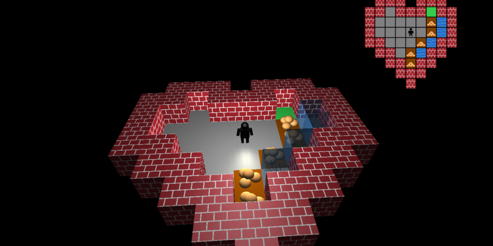

# FHW-CG1 ([English](README.md))
Unsere Lösungen für die Computergrafik (CG1) Übung an der [FH Wedel](https://www.fh-wedel.de/).
Während des Sommersemesters 2019 in Zusammenarbeit von
Daniel Klintworth ([@klintwood](https://github.com/klintwood)) und 
Nicolas Hollmann ([@NHollmann](https://github.com/NHollmann)) entstanden.

**Alle Kommentare sind auf Deutsch.**

Das Repository enthält Lösungen für 5 unterschiedliche Übungen:
1. Ein Pong Klon in 2D.
2. Ein 2D Labyrinth Puzzle Spiel.
3. Ein 3D Labyrinth Puzzle Spiel, aufbauend auf der vorherigen Übung.
4. Eine interaktive Wasserwellen Simulation mit Texturen.
5. Eine Shader Übung mit Vertex und Fragment Shadern die eine Landschaft anzeigen. Enthält Phong und Gouraud Beleuchtungsmodell.

Du kannst mehr Informationen wie Bilder und Übersetzungsanweisungen in der [Dokumentation](https://nhollmann.github.io/FHW-CG1/) (Englisch) finden.

