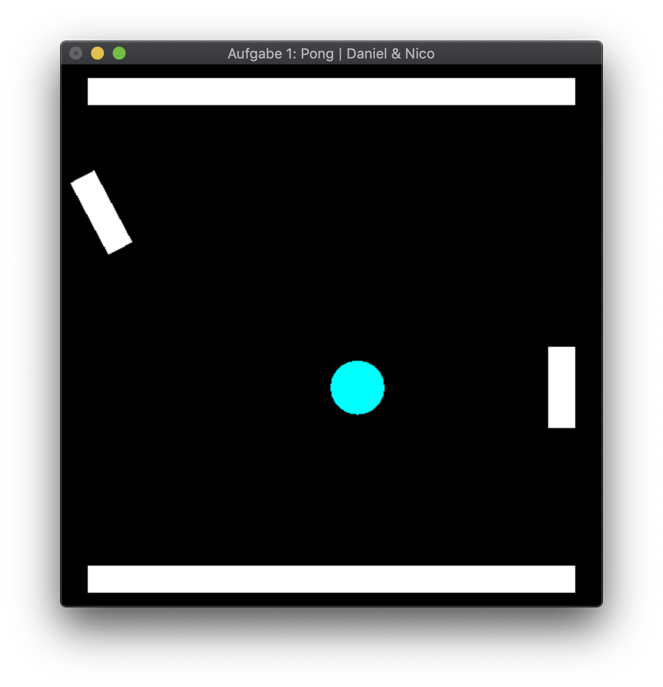

[Go back](../)

# Exercise 1
A Pong clone in 2D.

## Description
The core goals of this exercise were:
* 2D
* Introduction to OpenGL
* Double Buffering
* Affine transformations

We had the task to develop a clone of the classic pong game in 2D.
As an extra feature, the paddle of the human player must be able to rotate.

## 3rd Party
No 3rd party assets used.

## Images

