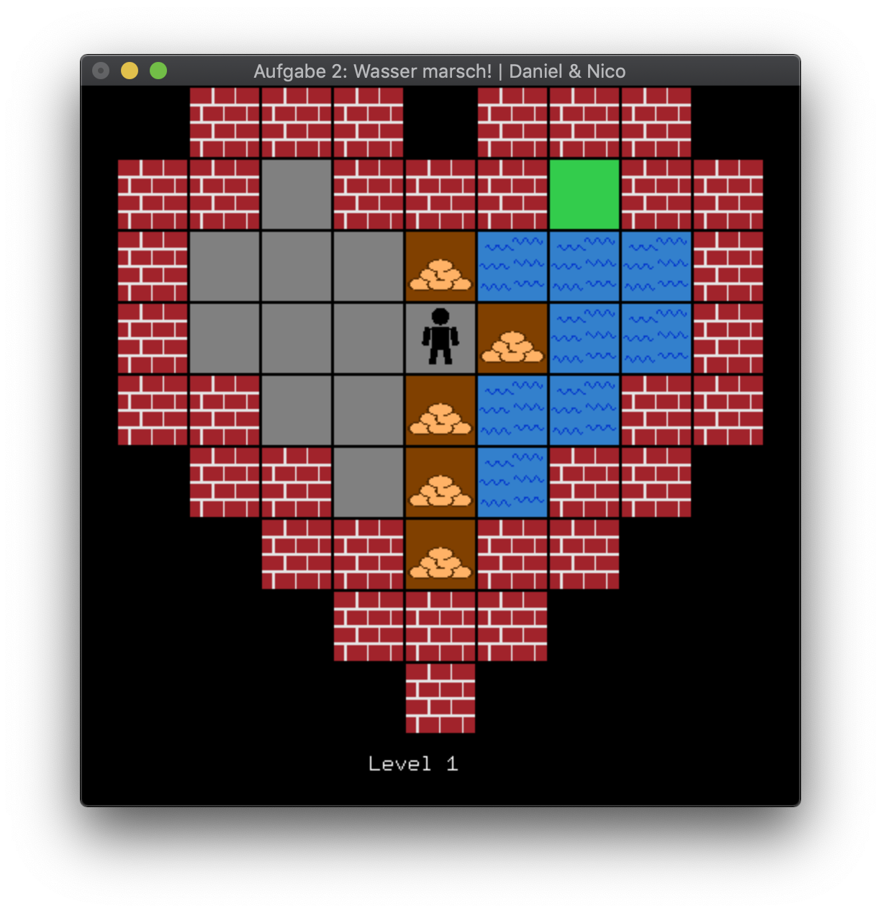
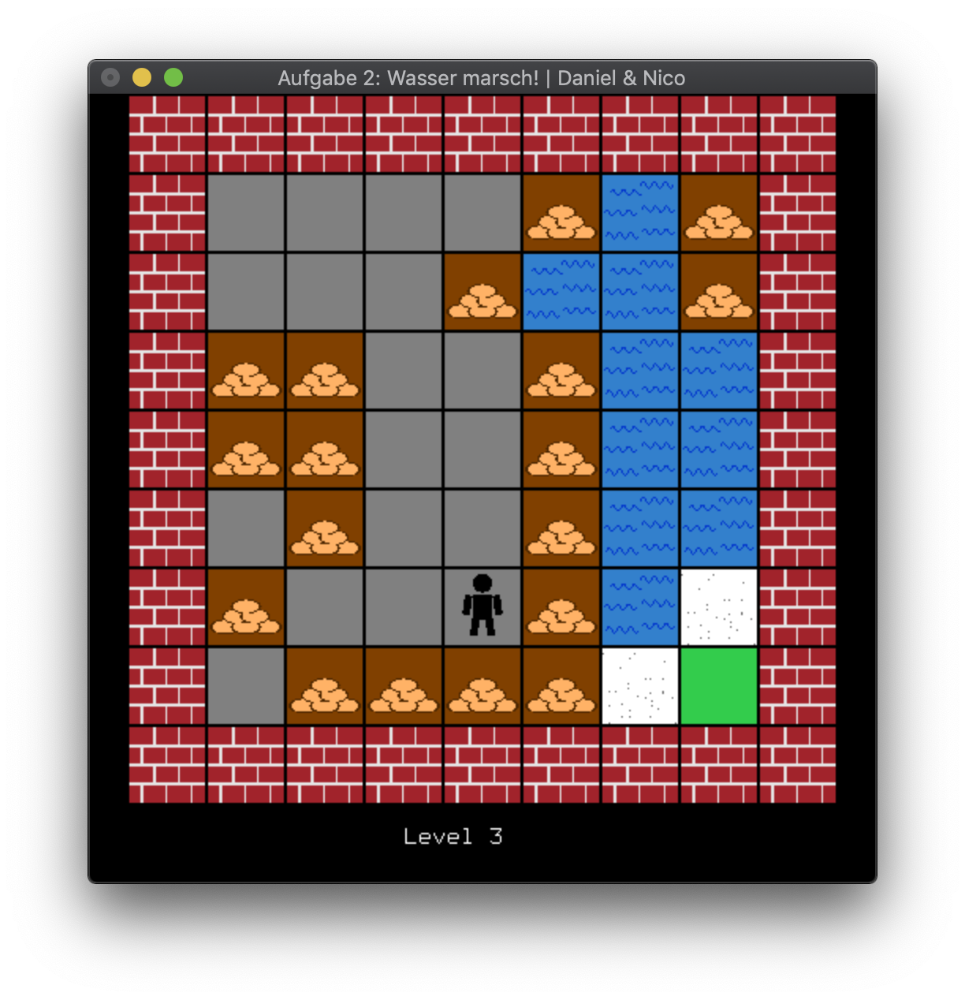
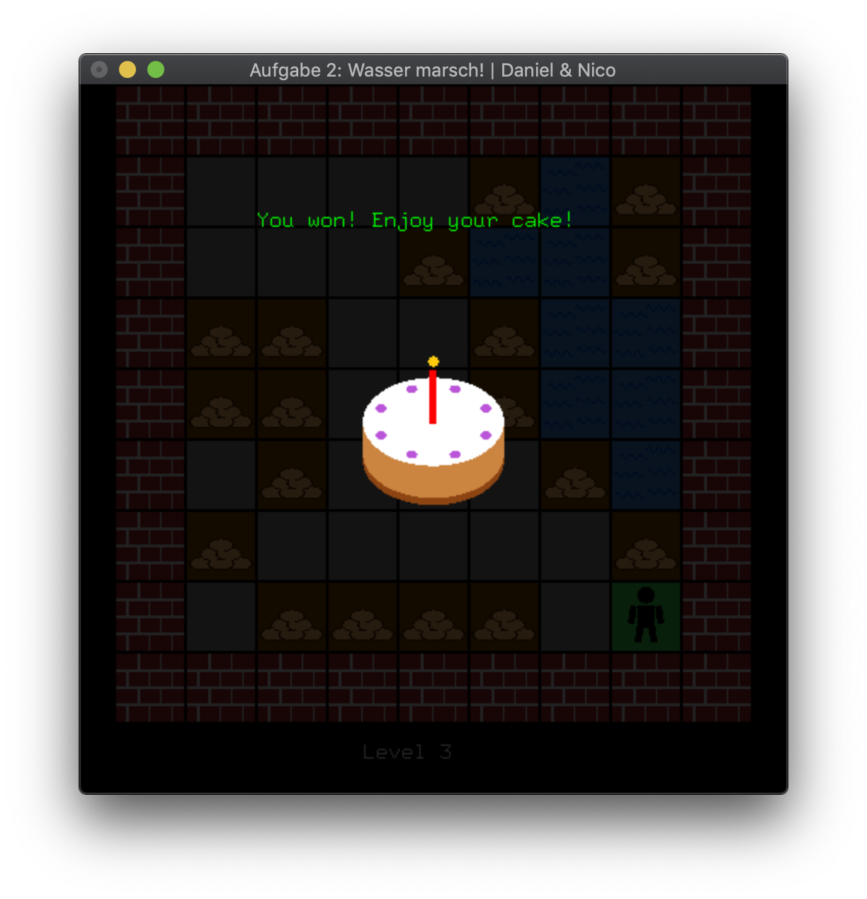

# Exercise 2
A 2D Labyrinth Puzzle Game.

## Description
The core goals of this exercise were:
* Displaylists
* Text output
* Viewports
* Gamelogic

This exercise is a game. The target is to reach the green tile on the map. 
If you touch water, you'll die. The sandbags can be moved. Sugar smelts if it is touched by water.
The water slowly floods free tiles.

There are **four** levels. The last one looks like the first one, don't get fooled.

## 3rd Party
No 3rd party assets used.

## Images

