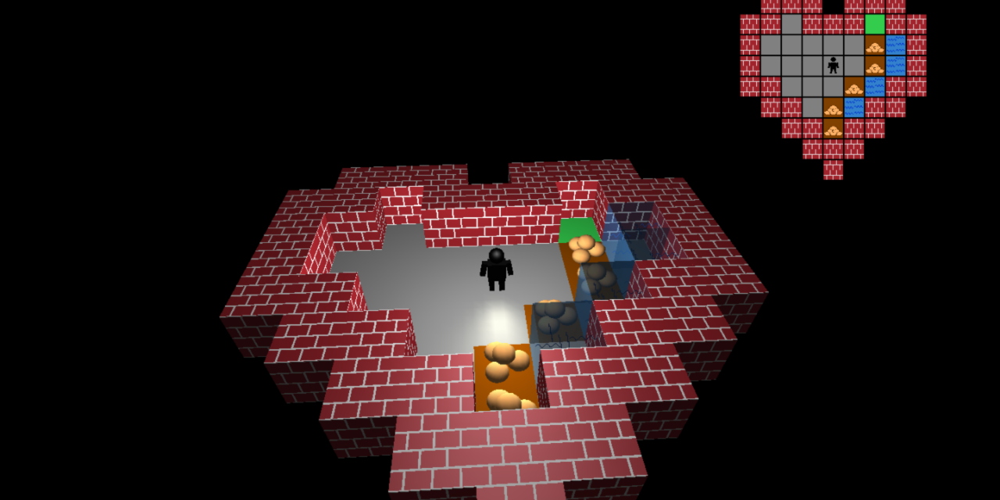
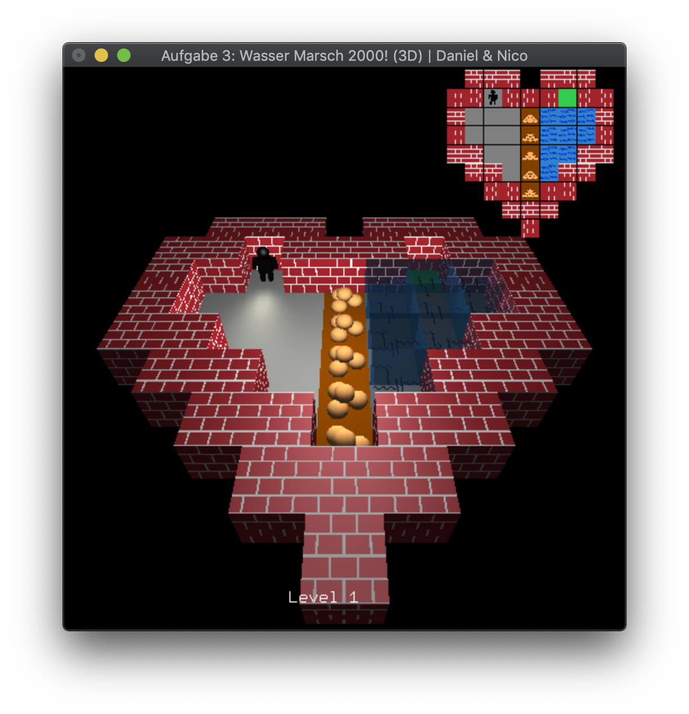
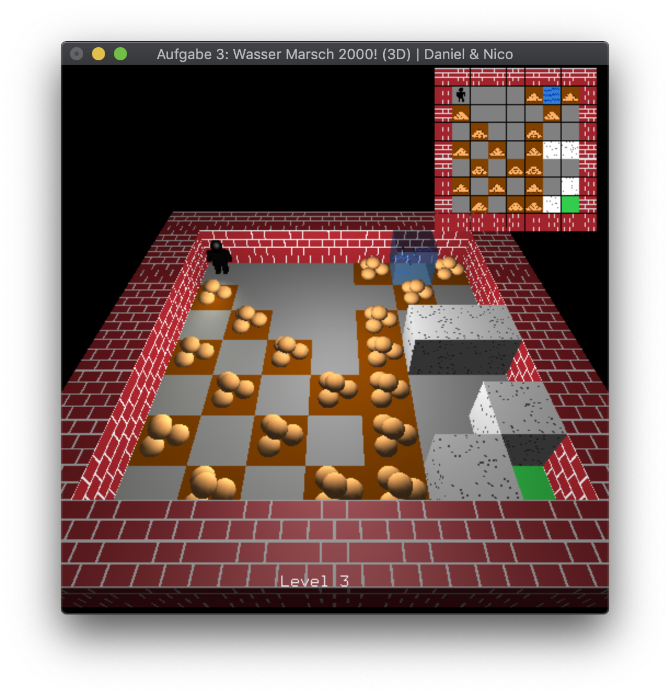
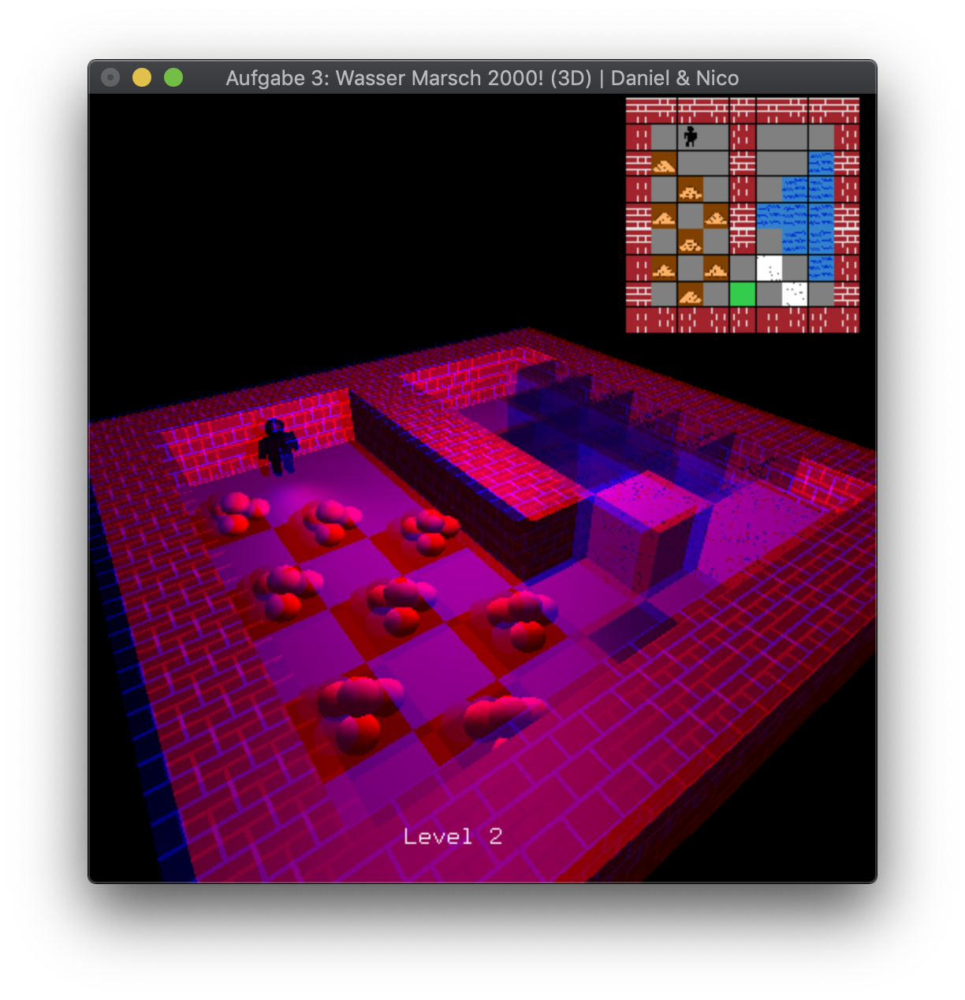
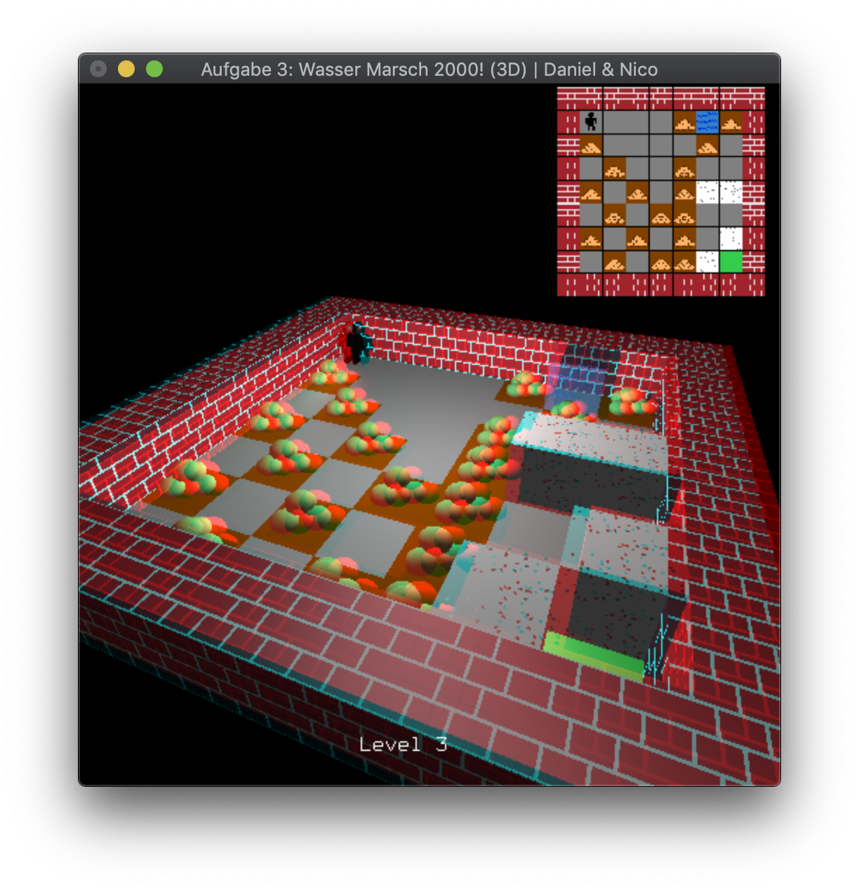

[Go back](../)

# Exercise 3
A 3D Labyrinth Puzzle Game, building on the [previous exercise](../ueb02/).

## Description
The core goals of this exercise were:
* 3D
* Lighting
* Viewports
* Transparency

This is the same game as in the [last exercise](../ueb02/), but now in 3D. 
Some of the new features are lights, transparent water and animations. For all features please look at the help.
It lists all features that are available. 

## Extra feature
We added support for 3D anaglyph. If you have glasses with a red/blue filter you can view the game in "true" 3D.
To enable this mode, press F4 once for grayscale and twice for color mode.

## 3rd Party
No 3rd party assets used.

## Images

