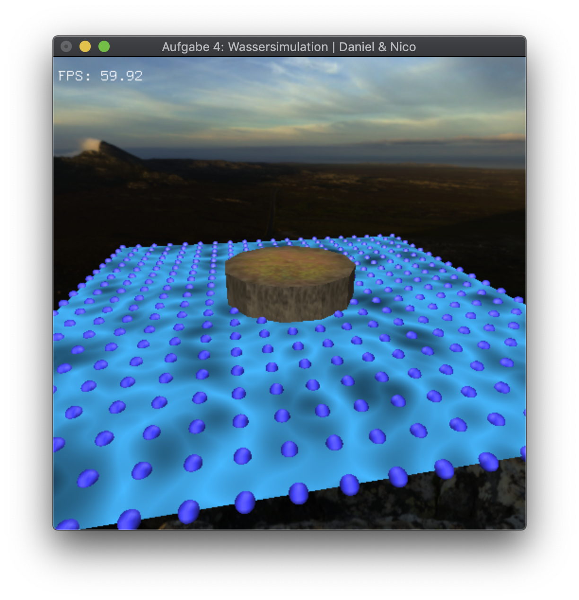
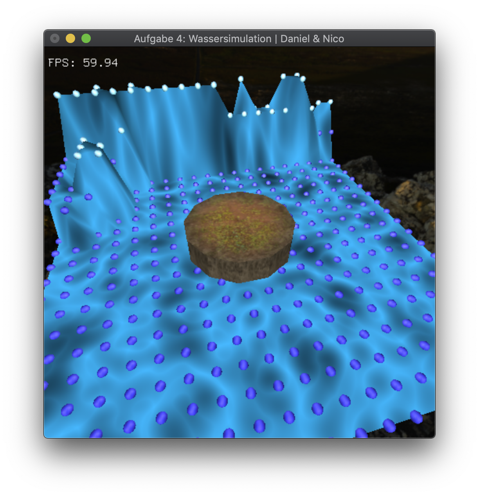

[Go back](../)

# Exercise 4
An interactive water wave simulation with textures.

## Description
The core goals of this exercise were:
* Vertex-Arrays
* Picking
* Textures

In this exercise we developed a simple water simulation. 
You can raise or lower the water at different spots and then watch how the water behaves.
The resolution of the water grid can be changed dynamicly while the program is running.
If you pause the simulation, you can "draw" a wave until you unpause.

## Extra feature
We added a skymap for the water simulation.

## 3rd Party
* [stb_image.h](https://github.com/nothings/stb) was used for image loading.
* The dirt and land texture were from [Texturehaven](https://texturehaven.com/textures/).
* The skymap was from [HDRIHaven](https://hdrihaven.com/hdris/).

## Images

