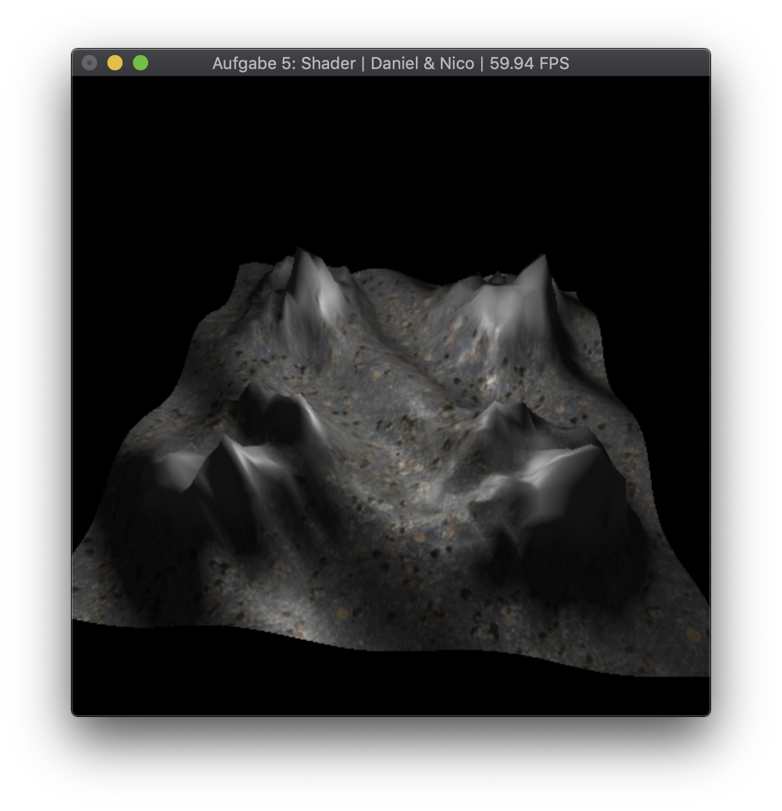

[Go back](../)

# Exercise 5
A shader exercise using vertex and fragment shaders to display a terrain. 
Includes Phong and Gouraud lighting models.

## Description
The core goals of this exercise were:
* TODO

TODO

## Extra feature
We added normalmapping to the shader. To enable normalmapping, press B. This effect is most visible with disabled textures.

## 3rd Party
* [stb_image.h](https://github.com/nothings/stb) was used for image loading.
* The snow and rock texture were from [Texturehaven](https://texturehaven.com/textures/).

## Images

